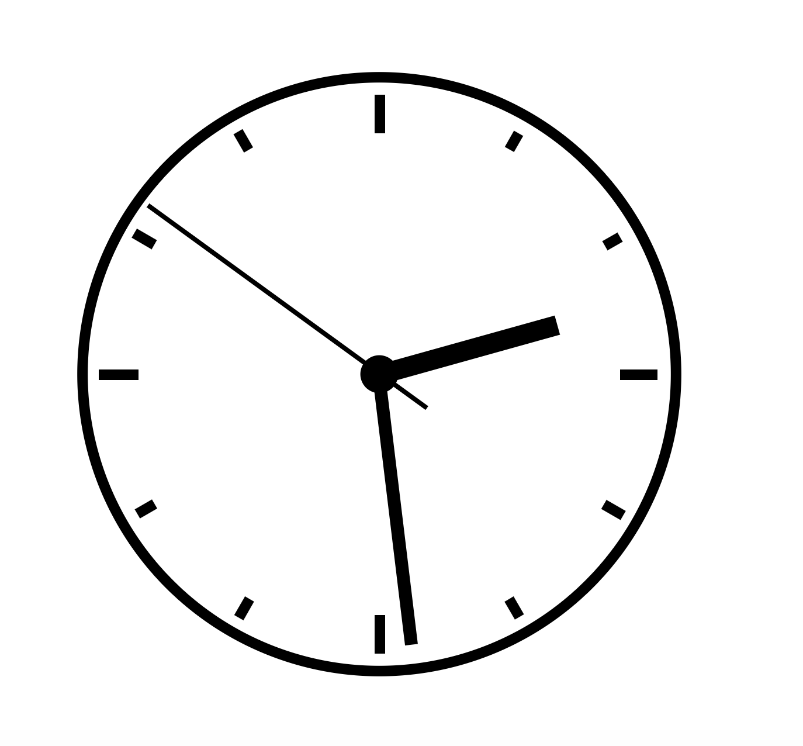

### Introduction

This is a mini project to practice the DOM manipulation by using JavaScript from the JavaScript Essential Training course on the Linkedin Learning platform. 

The goal is to create a clock which shows the live time and move the clock arms second by second. 

This project fully focus on the JavaScript part, the HTML and CSS files were premade.

