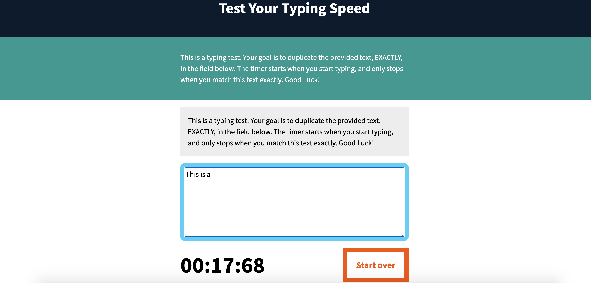
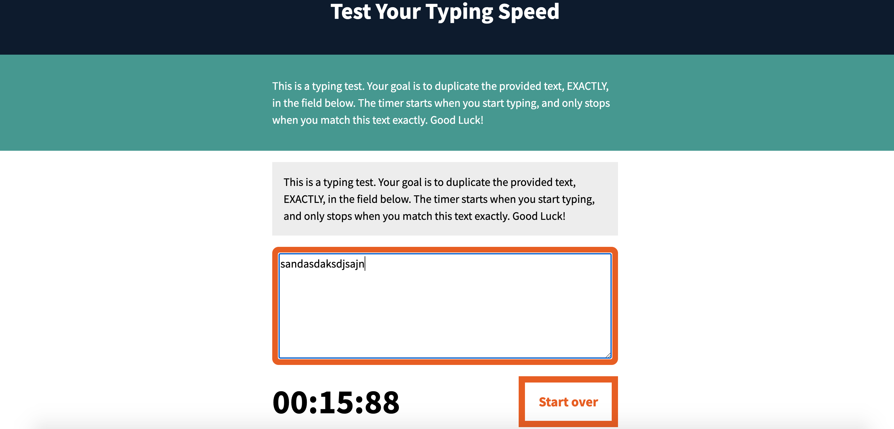
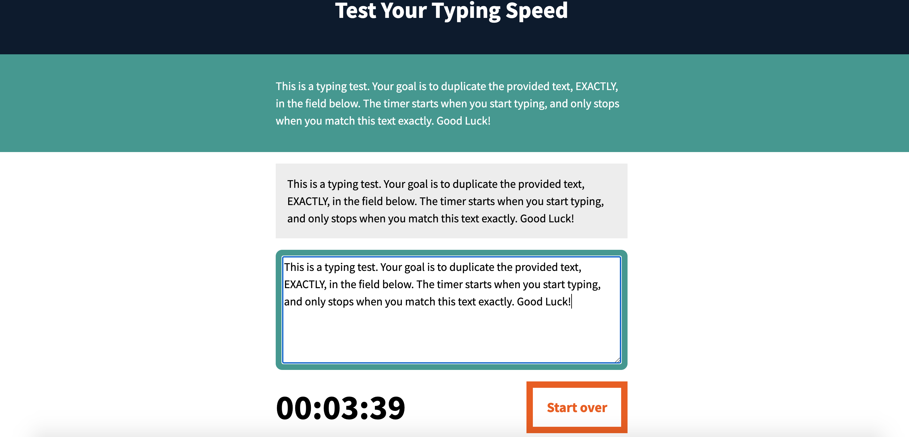

### Introduction

This is a mini project to practice the DOM manipulation, how to use the events by using JavaScript and some mathmatic calculation from the JavaScript Essential Training course on the Linkedin Learning platform. 

The goal is to duplicate the provided text, EXACTLY, in the input field. The timer starts when you start typing, and only stops when you match this text exactly. 

When you are typing, if the typing text is correct, we'll have a blue line around the test area; If the mistake is made, the line turns orange; After you finish typing the whole text, if typing text matches exactly same as the text above the typing area, the line will turn green.

This project fully focus on the JavaScript part, the HTML and CSS files were premade.

### preview

  
  
  

